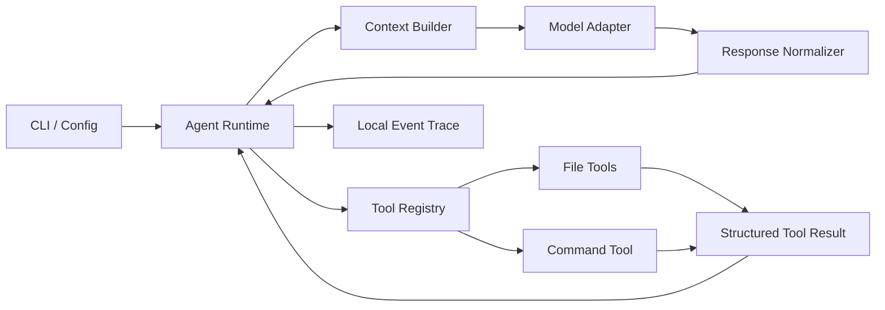
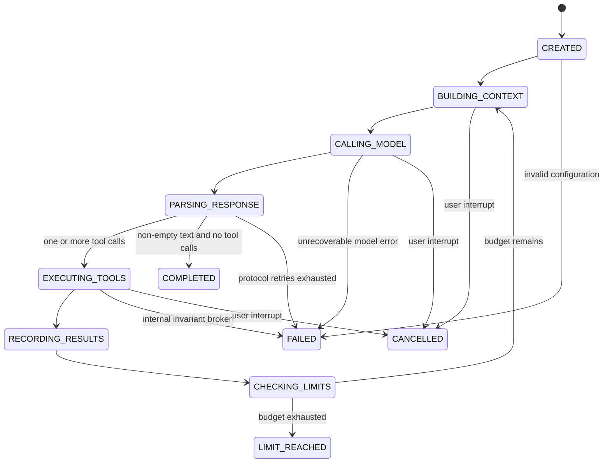

# 编程智能体设计文档

> 状态：Draft v0.1  
> 更新日期：2026-08-28  
> 用途：项目实现、测试、演示和面试答辩的共同设计基线。本文件不是最终提交的 `README.txt`。

## 1. 项目定位

本项目实现一个轻量、单进程、单智能体的命令行 Coding Agent。用户给出自然语言任务和本地工作区后，Agent 通过大语言模型的原生 tool calling，自主选择本地工具读取和修改文件、执行命令，并在明确的边界内循环工作直至终止。

项目的重点不是在四天内复刻商业 Coding Agent，也不以附加算法或界面作为主要卖点，而是完整、自主地实现并理解一个 Agent Runtime：

- 对话历史与上下文管理；
- 工具定义、参数校验、注册与本地执行；
- 模型响应归一化和工具调用解析；
- 显式、有限的 Agent 控制循环；
- 终止条件、错误分类和恢复策略；
- 可由确定性测试验证的协议不变量。

### 1.1 最小成功标准

1. CLI 能接收工作区和自然语言任务。
2. Agent 能自主完成“查看项目 -> 阅读代码 -> 修改文件 -> 运行命令 -> 根据结果继续”的闭环。
3. 上述核心逻辑均由项目自行实现，不依赖 Agent 框架或服务端托管工具。
4. 关键正常路径和失败路径可通过不调用真实 API 的单元测试验证。
5. 能稳定演示 Agent 完成一个真实、小型编程任务。
6. 每项关键设计都能说明选择理由、代价和不保证的边界。

### 1.2 明确不做

核心 Runtime 四天版本不实现：

- Web UI 或复杂 TUI；
- 多 Agent、Reviewer 角色或多模型路由；规划能力只提供一个显式 opt-in、无副作用的 `update_plan` 观察工具，不参与正确性判断或终止决策；
- RAG、向量数据库或跨会话长期记忆；
- 流式模型响应和并行工具执行；
- 通用 diff/patch 语言解析器；
- LLM 自动摘要历史；
- checkpoint、崩溃恢复或 exactly-once 执行语义；
- Docker、容器或操作系统级强安全沙箱；
- 对所有模型厂商、操作系统和编程语言的兼容承诺；
- 自动证明修改正确。

Harbor 外部适配器和 benchmark runner 属于核心 Runtime 之外的可选评测层。它们不改变上述单 Agent 控制循环，也不把 Docker/Harbor 变成默认安装依赖。

## 2. 题目合规映射

| 题目要求 | 本项目的实现方式 |
|---|---|
| 不得封装现成 Agent 产品 | 从模型 API 之上自行实现完整控制循环和本地运行时 |
| 不得使用 Agent 框架 / SDK | 不使用 LangChain、Agents SDK、AutoGen 等编排框架 |
| 可以使用模型厂商客户端 | 客户端仅负责 HTTP、鉴权和基础响应对象，不负责 Agent 循环 |
| 自行管理历史和上下文 | 保存规范历史，每轮由 `ContextBuilder` 生成预算内的派生视图 |
| 自行定义和执行工具 | 本地 `ToolRegistry`、参数校验器和工具处理器统一调度 |
| 自行解析模型输出 | 将目标 API 响应归一化为内部 `ModelTurn`，校验工具名、ID 和参数 |
| 自行实现循环终止 | 正常结束、预算上限、用户中断和不可恢复错误均有独立终态 |
| 自行处理错误 | 区分模型暂时错误、永久错误、工具请求错误、命令结果和内部错误 |
| 不使用托管文件/执行工具 | 所有文件操作和命令都在用户本机由本项目进程执行 |
| 凭据不得泄露 | API key 只从环境变量读取，不写日志、仓库、README 或视频 |

原生 tool calling 已经提供结构化的工具调用字段，但不会替本项目完成历史拼装、工具结果配对、本地执行、上下文裁剪、循环控制或错误恢复。这些是本项目真正自行实现的部分。

## 3. 设计原则

1. **协议正确优先于功能数量**：历史和 tool call/result 配对必须始终合法。
2. **控制流显式且有界**：用可观察的状态转换描述循环，不依赖无限 `while` 和笼统异常捕获。
3. **模型输出是不可信输入**：所有工具名、JSON 参数和路径都必须校验。
4. **工具失败通常是观察结果**：测试失败、命令非零退出等应交给模型分析，不等同于 Agent 崩溃。
5. **副作用不盲目重试**：模型请求可以有限重试，本地写入和命令不能在结果不明时自动重放。
6. **完整历史与模型上下文分离**：规范历史只追加；给模型的上下文是受预算约束的派生视图。
7. **不夸大安全性和正确性**：工作目录不是沙箱；模型停止也不是正确性证明。
8. **真实 API 不是单元测试依赖**：控制器通过 Scripted/Fake Model 做确定性测试。

## 4. 总体架构



### 4.1 建议目录结构

```text
src/coding_agent/
  cli.py              # CLI 参数、环境变量、退出码
  config.py           # 模型、工作区、预算和超时配置
  types.py            # Message、ToolCall、ToolResult、ModelTurn、RunState
  agent.py            # 唯一控制循环和状态转换
  context.py          # 规范历史到预算上下文的转换
  model.py            # ModelClient 协议和唯一的模型适配器
  response_parser.py  # 厂商响应归一化、arguments JSON 解析
  policy.py           # 重试、预算和终止策略
  errors.py           # 错误分类
  events.py           # 本地 JSONL 运行事件，不承担恢复职责
  tools/
    base.py           # Tool 契约
    registry.py       # 注册、schema 校验和统一错误包装
    filesystem.py     # list/search/read/write/replace
    shell.py          # run_command
tests/
  fakes.py
  test_agent.py
  test_context.py
  test_model.py
  test_tools.py
  test_policy.py
```

模块可以在实现中合并，但职责边界不能消失。显式状态机也不意味着为每个状态创建一个类；一个清晰、受测试的控制循环更适合当前规模。

### 4.2 核心内部类型

| 类型 | 关键字段 | 职责 |
|---|---|---|
| `Message` | `role`, `content`, `tool_calls`, `tool_call_id` | 表示规范化历史消息 |
| `ToolCall` | `id`, `name`, `arguments_json` | 保存模型请求的原始工具调用 |
| `ToolResult` | `call_id`, `name`, `ok`, `content`, `metadata` | 统一表达成功、请求错误和执行结果 |
| `ModelTurn` | `text`, `tool_calls`, `finish_reason`, `usage` | 屏蔽目标 API 的响应对象差异 |
| `RunState` | 历史、阶段、计数器、开始时间、终态原因 | Agent 循环的唯一可变状态 |
| `RunEvent` | 时间、事件类型、摘要、耗时 | 用于本地审计和调试，不用于自动重放 |

## 5. Agent 状态机



状态名称用于明确行为和测试断言；实现不要求机械地把每一步拆成独立对象。

### 5.1 终态语义

| 终态 | 含义 |
|---|---|
| `COMPLETED` | 模型返回非空 final text 且没有工具调用，控制循环正常结束 |
| `LIMIT_REACHED` | 轮数、工具调用数或总时间达到上限 |
| `FAILED` | 配置、模型协议或内部不变量出现不可恢复错误 |
| `CANCELLED` | 用户通过 Ctrl-C 等方式中断 |

`COMPLETED` 只表示“模型决定停止且协议正常”，不等于任务被证明正确。若执行过验收命令，最终报告可以附带最近命令及退出码；没有客观验收时必须显示“未验证”，不能把模型自述标记为 `VERIFIED`。

### 5.2 每轮控制逻辑

1. 检查取消状态、总时间、模型轮数和工具调用预算。
2. 从规范历史构建预算内上下文。
3. 调用模型；暂时性错误只在本轮内部有限重试。
4. 将厂商响应归一化为 `ModelTurn`。
5. 若包含工具调用，保留同时返回的文本，但不得将其视为最终答案。
6. 按模型返回顺序串行执行所有工具调用。
7. 每个调用都生成恰好一个 `ToolResult`，包括非法参数和未知工具。
8. 追加完整 assistant 消息和全部 tool result，再进入下一轮。
9. 若没有工具调用且有非空文本，进入 `COMPLETED`。
10. 若响应既无调用也无有效文本，按协议错误策略处理。

多个工具调用采用串行执行，以保证结果顺序确定并避免并行写冲突。若普通工具调用失败，仍继续处理同一批次的其他调用；若发生用户取消或内部致命错误，剩余调用记录为 `skipped`，不再执行副作用。

## 6. 消息协议与不变量

以下规则必须由代码断言并由测试覆盖：

1. system 指令和原始用户任务在每次模型调用中都存在。
2. 一条模型响应在规范历史中只能追加一次。
3. 每个 assistant `tool_call.id` 在下一次模型调用前必须有且仅有一个匹配的 tool result。
4. tool result 的 `tool_call_id`、工具名和原调用保持一致。
5. 未知工具、非法 JSON、缺少字段和类型错误也必须形成结构化 tool result，不能使进程直接崩溃。
6. 上下文裁剪以完整事务块为单位，不能保留孤立的 tool call 或 tool result。
7. 同时包含文本和工具调用的响应优先执行工具，文本仅作为该 assistant 回合内容保存。
8. 无文本、无工具调用的空响应不能被当作完成。
9. 进入任一终态后，不允许继续调用模型或执行工具。
10. 所有预算计数器单调增长，且终态原因唯一。

所谓“自行解析模型输出”不是重新实现 HTTP JSON 解析，而是完成从厂商响应到上述内部协议的归一化和校验。目标适配器只保证一个实际测试过的 OpenAI-compatible 服务，不宣称兼容所有声称兼容的网关。

## 7. 历史与上下文管理

### 7.1 两层历史

- **规范历史（canonical history）**：进程内只追加，保存系统消息、原始任务、模型响应和工具结果。
- **模型视图（context view）**：每次请求前从规范历史派生，在预算内保留必要消息。

裁剪模型视图不会修改规范历史。首版只做确定性裁剪，不调用另一个模型生成摘要，以避免额外费用、延迟和事实失真。

### 7.2 事务块

一个工具事务块定义为：

```text
assistant(tool_calls=[A, B, ...])
tool_result(call_id=A)
tool_result(call_id=B)
...
```

事务块在上下文中必须整体保留或整体移除。普通 assistant 文本与随后的用户消息也按完整回合处理。

### 7.3 预算策略

首版采用保守的字符预算，不声称是目标模型的精确 token 计数：

1. 固定保留 system 指令和原始任务。
2. 工具输出进入历史前先做单项限长。
3. 从新到旧选择完整事务块，装入剩余预算后恢复时间顺序。
4. 被移除的旧事务用一条确定性说明告知模型存在历史裁剪，但不编造内容摘要。
5. 若 system、原始任务、工具 schema 和最近必要事务本身已经超限，则抛出 `ContextOverflow`，不能静默删除任务约束。
6. 若服务端仍报告 context length 错误，缩小派生视图后重试一次；再次失败则终止。

### 7.4 工具输出截断

读取文件和命令输出必须包含：

- 是否截断；
- 原始字节数或行数；
- 实际返回范围；
- 在可能时保留首尾内容；
- 明确提示模型使用分段读取获取更多内容。

截断发生在结果进入模型历史之前，避免单个工具结果挤掉整个上下文。

## 8. 工具系统

### 8.1 统一工具契约

每个工具必须提供：

- 唯一名称和简洁说明；
- 发送给模型的参数 schema；
- 项目自行实现的必要字段、类型和额外字段校验；
- 统一的成功结果；
- 统一的请求错误和执行错误结果；
- 是否可能修改工作区的元数据。

所有调用都必须经过 `ToolRegistry`。Agent Runtime 不直接调用具体 handler。

### 8.2 MVP 工具

| 工具 | 主要参数 | 行为 |
|---|---|---|
| `list_files` | `path` | 列出工作区内文件，结果限量 |
| `search_text` | `query`, `path` | 搜索文本并返回文件、行号和匹配片段 |
| `read_file` | `path`, `start_line`, `end_line` | 按行范围读取文本文件 |
| `write_file` | `path`, `content` | 创建或原子替换整个文件 |
| `replace_in_file` | `path`, `old`, `new` | 仅在 `old` 唯一匹配时原子替换 |
| `run_command` | `command`, `timeout_seconds` | 在 workspace 为 cwd 执行非交互 POSIX 命令 |

不实现自定义 unified diff 解析器。`replace_in_file` 用唯一匹配避免替换错位置；新建文件和确需整体重写时使用 `write_file`。

### 8.3 文件边界

文件工具必须：

1. 将用户路径相对 workspace 解析并规范化。
2. 拒绝绝对路径、`..` 逃逸和解析后不位于 workspace 的路径。
3. 拒绝通过现有符号链接指向 workspace 外部的访问。
4. 写入时在目标目录创建临时文件，再使用 `os.replace` 原子替换。
5. 不把无法解码的二进制内容伪装成普通文本。

### 8.4 命令执行边界

`run_command` 的首版边界是：

- 仅支持 POSIX；
- 使用 workspace 作为 `cwd`；
- 支持普通 shell 管道等演示所需语法；
- 不接受交互式输入；
- 默认构造净化后的子进程环境，不继承模型 API key、Authorization 值及名称匹配 `*_TOKEN`、`*_SECRET`、`*_PASSWORD` 的变量；
- 首版 CLI 不提供任意环境变量透传；程序化扩展若显式传入项目变量，其值不得写入事件日志；
- 设定 wall-clock timeout；
- 超时时终止整个进程组，而不仅是父进程；
- 分别捕获 stdout、stderr、退出码、耗时和 timeout 状态；
- 对 stdout/stderr 做明确限长；
- 命令非零退出和 timeout 都作为可分析的 `ToolResult` 返回，不自动重跑。

**重要边界：`cwd=workspace` 不是安全沙箱。** Shell 仍可能访问绝对路径、网络或执行仓库中的任意代码。首版只应在用户授权的可信本地工作区运行，不能宣称整个 Agent 被限制在 workspace 内。文件工具的路径保护不等价于命令隔离；真正隔离需要容器或操作系统级沙箱，本项目首版不实现。

## 9. 错误分类与处理

| 类别 | 示例 | 处理策略 |
|---|---|---|
| `ConfigurationError` | 缺少 key、模型名或 workspace 无效 | 启动循环前立即失败 |
| `TransientModelError` | 网络超时、429、部分 5xx | 有上限退避重试，不重复计算 agent turn |
| `PermanentModelError` | 401、403、明确无效请求 | 立即 `FAILED` |
| `ContextOverflow` | 服务端拒绝上下文长度 | 缩小模型视图重试一次，再失败 |
| `ResponseProtocolError` | 空响应、无法归一化 | 同一请求有限重试，耗尽后失败 |
| `ToolRequestError` | 未知工具、非法 JSON、缺参、越界路径 | 形成结构化 tool result，让模型修正 |
| `CommandResult` | 非零退出码、测试失败、timeout | 正常观察结果，不视为 Runtime 异常 |
| `ToolExecutionError` | I/O、编码、子进程启动失败 | 包装成工具结果；日志记录必要诊断 |
| `InvariantViolation` | tool ID 重复、历史配对损坏 | 立即 `FAILED`，避免继续污染历史 |
| `UserCancelled` | Ctrl-C | 进入 `CANCELLED` |

禁止使用统一的 `except Exception: retry`。只有确认没有本地副作用的模型传输请求可以自动重试。文件写入依靠原子替换降低部分写入风险；shell 命令可能已经产生副作用，因此 timeout 或连接中断后绝不自动重放。

日志不得记录 Authorization header、完整环境变量或 API key。工具结果可能包含源代码或项目数据，因此运行日志应保存在被 `.gitignore` 忽略的本地目录，并明确不保证能自动识别项目文件中的所有秘密。

## 10. 终止和预算

### 10.1 必须实现

- 模型返回非空 final text 且无工具调用；
- `max_model_turns`；
- `max_tool_calls`；
- `max_wall_time`；
- 模型请求重试上限；
- 协议错误重试上限；
- 用户中断；
- 不可恢复配置、模型或内部错误。

每次模型请求和工具执行前后都检查相应预算，模型与命令 timeout 不得超过总时间的剩余预算。终止报告应包含终态、唯一原因、逻辑模型轮数、实际模型请求数、工具调用数和总耗时。

### 10.2 可选的无进展检测

重复调用检测属于 P1，而不是首版完成条件。若实现，只检测连续出现的 `tool name + canonical arguments + result hash`，第二次向模型返回无进展提示，第三次终止。任何不同调用或成功文件修改都重置连续计数。

必须用反例测试证明它不会把“修改后重新读取文件”或“修复后重新运行测试”误判为死循环；做不到则只保留硬预算，不实现启发式检测。

## 11. 模型适配器

### 11.1 边界

`ModelClient.complete(messages, tools, timeout_seconds=...) -> ModelTurn` 是 Runtime 与厂商接口的唯一边界。首版只实现一个 OpenAI-compatible 协议适配器。

可以使用厂商普通 API 客户端来完成：

- HTTPS 连接；
- API key 鉴权；
- 请求序列化；
- 基础响应反序列化。

项目自行负责：

- 选择和组织历史；
- 提供工具 schema；
- 归一化 assistant 文本与 tool calls；
- 解析和校验 arguments；
- 匹配 tool call/result ID；
- 执行本地工具；
- 决定重试、继续或终止。

### 11.2 首版取舍

- 使用原生 tool calling，而不是要求模型输出自定义 XML/Markdown JSON，以减少格式漂移。
- 不实现 streaming，避免处理增量 tool arguments 和半截 JSON。
- DeepSeek、GLM 和 custom 只提供 endpoint/key-name 配置预设，共用同一个协议适配器，不引入厂商专属控制循环。
- 默认不发送 temperature，以兼容不接受该参数的推理模型；模型执行不声称可完全复现。

普通客户端使用 `openai` Python 包；具体模型 ID 必须由运行者显式填写，不绑定可能变化的服务端别名。

## 12. 运行事件

运行时向终端显示简洁事件，并可选追加本地 JSONL：

- run started / ended；
- model request started / completed / retried；
- tool requested / completed / rejected；
- context truncated；
- budget reached；
- error / cancellation。

事件用于回答“Agent 为什么这样运转”和辅助排错，不等于可复现执行。模型输出具有非确定性，文件和外部命令状态也会改变。首版不基于事件日志实现断点恢复。

## 13. 测试策略

### 13.1 测试分层

1. **纯单元测试**：参数校验、响应归一化、上下文裁剪、预算和错误映射。
2. **Runtime 测试**：使用 Scripted/Fake Model 返回预设回合，验证完整状态转换。
3. **工具集成测试**：在临时工作区验证文件、符号链接、命令和进程超时。
4. **真实 API 冒烟测试**：只用于开发和演示前核验，不作为默认测试套件的前提。
5. **端到端演示**：在独立小项目完成一个真实编程任务。

### 13.2 最小验收矩阵

自动化验收已覆盖下列本地项目项（当前 `211 passed`）；真实模型和视频项仍保留为现场交付步骤。

- [ ] 模型直接返回 final text，Runtime 进入 `COMPLETED`。
- [ ] `read -> edit -> run test -> final` 完整链路正确。
- [ ] 一次响应包含多个工具调用，执行顺序和 call ID 配对正确。
- [ ] 同时返回文本和工具调用时不会提前结束。
- [ ] 非法 arguments JSON 形成工具错误，模型下一轮可以修正。
- [ ] 未知工具、缺少字段和错误类型不会导致进程崩溃。
- [ ] 普通工具失败不会破坏后续消息协议。
- [ ] 429/网络 timeout 有限重试，401/403 不重试。
- [ ] 最大轮数、工具调用数和总时间分别触发正确终态。
- [ ] 用户中断后不再发生模型或工具调用。
- [ ] 工具输出截断后包含明确元数据。
- [ ] 上下文裁剪不拆散 tool call/result 事务块。
- [ ] `../`、绝对路径和 symlink 越界被文件工具拒绝。
- [ ] 文件替换失败不会留下半写入目标。
- [ ] 命令 timeout 会终止整个进程组。
- [ ] 命令非零退出作为结果反馈，而不是 Runtime 崩溃。
- [ ] `run_command` 默认不从继承环境中获得模型 API key；这不是对 `/proc`、绝对路径或其他宿主访问方式的沙箱保证。
- [ ] 日志和异常信息不包含配置中的 API key。

## 14. 演示原则

演示任务应真实但范围可控，至少包含：

1. 用户给出自然语言编程任务。
2. Agent 列出或搜索项目文件。
3. Agent 分段阅读相关代码。
4. Agent 修改或创建文件。
5. Agent 运行测试或其他验收命令。
6. 若命令失败，Agent 根据结构化结果继续处理。
7. 最终终端显示结束原因、调用统计和最近验收结果。

视频不通过人为制造大量炫技功能证明项目价值，而应让评委清楚看到“模型决策 -> 本地工具 -> 结果回填 -> 下一轮”的真实闭环，并用少量代码画面说明历史、状态机、错误处理均由项目实现。

## 15. 四天实施计划

实施记录：第 1--3 天的核心 Runtime、工具、上下文、终止和本地测试已完成；当前还完成了第 19 节列出的独立验收、ATIF、Harbor 桥接和 benchmark 代码。已在干净副本完成 wheel 安装、211 项测试、Ruff、格式检查和编译验证。真实 API 冒烟、Docker/Harbor 评测、视频录制和最终 zip 仍是交付前的现场步骤，本仓库默认不执行这些外部操作。

### 第 1 天：协议和主循环

- 初始化新公开 Git 仓库并建立正常提交历史；
- 完成内部类型、ModelClient 协议和 Scripted Model；
- 完成最小 Agent 循环、工具注册表和 `read_file`；
- 测通 `read -> final`，提交第一组单元测试。

### 第 2 天：完整本地工具和错误边界

- 完成 list/search/read/write/replace/run_command；
- 完成路径校验、原子写入、timeout、进程组终止和输出限长；
- 完成工具参数错误、执行错误和模型错误分类；
- 补齐工具集成测试。

### 第 3 天：上下文、终止和真实模型

- 完成事务块裁剪和字符预算；
- 完成轮数、调用数、总时间和取消终止；
- 接入一个实际 API，进行多个真实任务冒烟测试；
- 加入简洁终端事件和本地 JSONL 轨迹；
- 修复真实运行暴露的问题，不增加大功能。

### 第 4 天：冻结、交付和答辩

- 从全新 clone 安装并运行测试；
- 固定并重复演示任务，确认 API key 不出现在画面或日志；
- 完成仓库 `README.md` 和 1000 汉字以内的提交版 `README.txt`；
- 录制不超过 2 分钟、200 MB 的 mp4；
- 根据实际成品重写 1 分钟英文介绍和面试问答；
- 检查完整 Git 历史无凭据，再制作最终 zip。

## 16. 决策记录

| 决策 | 理由 | 放弃的替代方案 / 代价 |
|---|---|---|
| 单 Agent、顺序工具 | 控制流可解释，副作用顺序确定 | 不追求并发速度 |
| 原生 tool calling | 比自定义文本协议稳定 | 绑定目标 API 消息协议 |
| 规范历史与模型视图分离 | 裁剪不破坏事实记录 | 占用更多进程内存 |
| 确定性裁剪 | 无额外模型费用，不引入摘要幻觉 | 旧细节可能直接丢失 |
| 字符预算 | 跨模型且实现简单 | 不是精确 token 计数 |
| 唯一文本替换 | 易校验且不需自研 patch parser | 大范围编辑效率较低 |
| 非流式模型调用 | 协议和错误路径更简单 | 首 token 延迟更高 |
| POSIX trusted workspace | 四天内能正确实现和说明边界 | 不提供强隔离和跨平台保证 |
| 事件日志但不恢复 | 可观察、易排错 | 不能断点续跑或重放 |
| Fake Model 测试控制器 | 快速、确定、无 API 费用 | 仍需少量真实 API 冒烟测试 |

## 17. 待确认事项

- [x] 项目名称、Python 包名和公开 GitHub 仓库地址已确定并写入 README。
- [x] DeepSeek/GLM/custom 共用 OpenAI-compatible 适配器；模型 ID 仍由运行者显式填写。
- [x] Python 最低版本为 3.11；默认预算、事件字段和工具边界已固化并有测试。
- [x] `run_command` 采用受信 workspace 模式，文档明确它不是强沙箱。
- [ ] 撤销曾在对话中暴露的旧 API key，并在真实演示前生成新 key。
- [ ] 选择最终演示仓库和任务，完成真实 API 冒烟与视频录制。
- [ ] 若评测环境具备 Docker/Harbor，执行第 20 节的外部冒烟和 benchmark 子集。

## 18. Definition of Done

项目只有同时满足以下条件才算实现完成：

- [ ] 所有题目指定的核心逻辑均由仓库代码自行完成。
- [ ] MVP 六个工具可用，且失败返回结构化结果。
- [ ] 消息协议不变量和全部终态有自动化测试。
- [ ] 默认测试无需 API key 即可运行。
- [ ] 至少一个真实模型端到端任务可重复完成。
- [ ] 文档没有把 cwd、路径校验或命令超时描述为强沙箱。
- [ ] 文档没有把模型 final text 描述为正确性证明。
- [ ] 仓库和完整 Git 历史不含任何凭据。
- [ ] README、视频和 zip 满足题目格式与截止要求。
- [ ] 本人能够解释每个模块、关键不变量、错误策略和明确限制。

## 19. 已实现的 Runtime-first 扩展

在 MVP 基础上，当前仓库增加了几项不改变核心控制流的可选能力：

### 19.1 ExecutionBackend 与协作式取消

`AgentRuntime` 只依赖 `ExecutionBackend` 的两个方法：返回模型工具 schema，以及对一个原始 `ToolCall` 返回一个完整 `ToolResult`。默认 `ToolRegistry` 继续在本机执行；外部环境可以实现同一契约而不复制 Runtime。`cancel_check` 只在模型请求前和工具之间轮询，正在运行的副作用工具仍由自己的 timeout 收尾，避免从其他线程强行打断并伪造结果。

### 19.2 独立 Verifier

`CommandVerifier` 接收运行者预先配置的固定命令，在 `AgentRuntime.run` 返回后于独立进程组执行。它不追加 history、不增加 model/tool 计数，也不把 `COMPLETED` 改写成新的 Runtime 状态。每个检查记录退出码、timeout、耗时和有界 stdout/stderr。CLI 的 `--verify` 是 opt-in；只有正常 `COMPLETED` 且检查失败时才返回退出码 4。命令仍继承当前用户权限，不是沙箱。

### 19.3 可选计划工具

`--planning` 才会注册 `update_plan`。工具以不可变 revision 保存 1--8 个步骤，更新要么整体成功要么不改变旧快照。它只用于观察模型的计划，不读写工作区，不运行命令；即使全部步骤是 `completed`，Runtime 仍必须等待模型 final text 或其他正常终止条件。

### 19.4 ATIF 投影

`atif.py` 从规范 `RunResult.history` 投影 Harbor-compatible `ATIF-v1.7`，严格检查 assistant call 与 tool result 的顺序、ID、名称。非法 arguments 不伪造为有效对象，而保留原始文本扩展字段。导出默认不包含 reasoning；写文件使用临时文件、`fsync` 和原子替换，并复用日志脱敏逻辑。原有 JSONL trace 格式保持不变。

### 19.5 Harbor 外部适配

`harbor_adapter.py` 不导入 Harbor 包，定义最小异步 `BaseEnvironment`/`BaseAgent` 协议。`HarborAgentAdapter` 把同步 Runtime 放在工作线程，`RemoteExecutionBackend` 将六个工具映射到容器 `/app` 并通过 `run_coroutine_threadsafe` 桥接环境的异步 `exec`。模型客户端和 API key 留在主机侧；容器只收到远程命令。`write_harbor_artifacts` 可在日志目录写 `trajectory.json` 和 `run.json`。真正的容器隔离、镜像和 Harbor 任务编排不在核心包内，需评测环境自行提供。

### 19.6 有界 Benchmark

`benchmark.py` 将任务 fixture、Agent argv、固定验收命令、重复次数和预算统一记录。每个 case 从干净副本开始，Agent 结束后才验收，输出 `coding-agent-benchmark/v1` JSON 报告并区分 `resolved`、`unresolved`、`agent_failed`、`timeout` 等状态。CLI 默认只规划，不启动外部进程；`--execute` 才执行。该工具用于同一模型的受控对比，不是官方 leaderboard 计算器。

外部 Agent 如需模型凭据，可在 manifest 中使用 `environment_from_host` 只列出变量名。运行时按当前 case 精确复制这些变量，值不写入 manifest/report；没有显式列出的敏感宿主变量继续被过滤。

## 20. 后续实验与交付检查

以下步骤需要真实模型或 Docker/Harbor，当前默认测试不会执行：

1. 撤销对话中曾暴露的旧 API key，并为每个模型生成新 key；只通过未入库环境变量提供。
2. 在干净 clone 中用一个小型真实仓库完成 `read -> edit -> run test -> final` 演示，录屏前检查终端、trace、视频和 zip 中没有凭据。
3. 若环境具备 Docker/Harbor，再运行 Harbor 冒烟；宿主 Runtime 使用同一模型配置，任务容器只提供 `/app` 环境。
4. Terminal-Bench 2.1 仅做后置子集实验：GLM Flash、8 个 coding-oriented 官方任务、每任务单次运行。建议任务名为 `fix-git`、`cancel-async-tasks`、`kv-store-grpc`、`polyglot-c-py`、`headless-terminal`、`fix-code-vulnerability`、`build-cython-ext`、`write-compressor`。公开套件有 89 个任务，官方 leaderboard 通常要求每任务至少 5 次，本实验不宣称官方成绩。
5. 最终提交 zip 只包含姓名命名的 `README.txt` 和不超过 2 分钟/200 MB 的 MP4；公开仓库保留完整提交历史，截止后不再推送。

## 21. 面试英文介绍（不超过 1 分钟）

> I designed and implemented a lightweight coding agent from scratch, without using an agent framework. The model uses ordinary OpenAI-compatible tool calling, while my runtime owns the conversation history, context budgeting, response validation, local file and shell tools, retries, cancellation, and finite termination rules. A key invariant is that every assistant tool call receives exactly one matching result before the next model request. I also added an optional independent verifier, so a model saying “done” is not treated as proof that the code is correct. For external evaluation, the same runtime can bridge to a Harbor-style container and export an ATIF trajectory. I tested the control flow with deterministic fake models and report benchmark results only when fixed acceptance checks pass.
